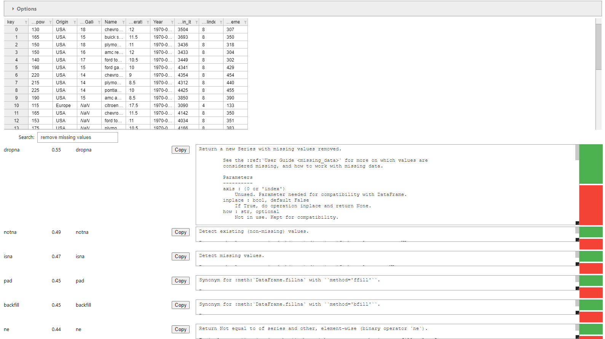

<!-- _class:
- lead -->
# PandaRec - A Recipe-Based Recommendation System for the Pandas Library

Frederick Vandermoeten

---
<!-- paginate: true -->
## Overview

- **Introduction**
- Approach
- Evaluation
- Conclusion

---
<!-- header: Introduction: Pandas -->
### Pandas

- Python library for data manipulation and analysis
- Works with DataFrames
- Existing recommendation systems don't work well with Pandas

---
<!-- header: Introduction: Code Recommendation Systems -->
### Code Recommendation Systems

- Help developers to write code
- Design dimensions:
  - Input
  - Recommendation Engine
  - Output
  - User Feedback

---

### Existing Code Recommendation Systems

- Code completion
  - Part of most IDEs
  - not that useful for Pandas
- Code generation
  - Boilerplate automation
  - Generative AI
    - ChatGPT
    - Copilot

---
<!-- header: "" -->
## Overview

- Introduction
- **Approach**
- Evaluation
- Conclusion

---
<!-- header: Approach: My Solution -->
### My Solution

- Jupyter Notebook
- Recipe-based recommendation system
- Swappable recommendation engine

---
<!-- header: Approach: Jupyter Notebook -->
### Jupyter Notebook

---
<!-- header: Approach: Recipes -->
### Recipes

- A data structure that describes a task
- Contains:
  - Name
  - Code snippet
  - Description
- saved in JSON format
- Generated from: dir() function, existing code snippets, hand-written

---
<!-- header: Approach: The Recommendation Engine -->
### The Recommendation Engine

- Strategy pattern
- Gets current context
- Search function that returns a ranked list of recipes

---
<!-- header: Approach: Ranking Strategies -->
### Ranking Strategies: Lexical Search

- Name Search
- Fuzzy Search
  - Levenshtein distance
- Index Search
  - Lemmatize words
  - Build an inverted index

---
<!-- header: Approach: Ranking Strategies -->
### Ranking Strategies: Semantic Search

- Use a NLP model to calculate the similarity between the query and the recipe descriptions
- BERT: Bidirectional Encoder Representations from Transformers
- Sentence-BERT: Sentence Embeddings using Siamese BERT-Networks

---
<!-- header: Approach: Ranking Strategies -->
### Ranking Strategies: Other

- OpenAI Embeddings
- OpenAI Chat Completion
- Websocket

---
<!-- header: "" -->
## Overview

- Introduction
- Approach
- **Evaluation**
- Conclusion

---
<!-- header: Evaluation: Metrics -->
### Metrics

- Speed:
  - Setup and search time
  - Under 100ms for search time is acceptable
- Accuracy:
  - NDCG

---
<!-- header: Evaluation: Metrics -->
### NDCG

- Normalized Discounted Cumulative Gain
- Measures the ranking quality

$$DCG = \sum_{i = 1}^{k} \frac{gains}{log_2(i+1)}$$
$$NDCG = \frac{DCG}{IDCG}$$

- Last rank k is important: NDCG@k

---

<!-- header: Evaluation: Speed -->
<!-- _class: lead -->
### Speed

| Name                     | Setup Delay         | Search Delay            |
| ------------------------ | ------------------- | ----------------------- |
| Name Search              | 68ns $\pm$ 0.2ns    | **6.53μs $\pm$ 0.08μs** |
| Fuzzy Name Search        | 68.4ns $\pm$ 0.5ns  | **756μs $\pm$ 1.3μs**   |
| Fuzzy Description Search | 276ns $\pm$ 0.8ns   | **10ms $\pm$ 0.05ms**   |
| Index Search             | 7.87s $\pm$ 0.08s   | **1.74ms $\pm$ 0.01ms** |
| Semantic Search          | 85s $\pm$ 1s        | **38.2ms $\pm$ 0.9ms**  |
| OpenAI Embedding         | 3s $\pm$ 1s         | 668ms $\pm$ 949ms       |
| OpenAI Chat Completion   | 530ns $\pm$ 14.9ns  | 27.4s $\pm$ 3.7s        |
| Saved Index/ Embedding   |
| Index Search             | 1.5ms $\pm$ 0.03ms  | -                       |
| Semantic Search          | 682ms $\pm$ 10ms    | -                       |
| OpenAI Embedding         | 27.5ms $\pm$ 0.25ms | -                       |

---
<!-- header: Evaluation: Accuracy -->
### Accuracy Setup

- Generate Test Dataset

---

<!-- header: Evaluation: Accuracy -->
<!-- _class: lead -->
### Accuracy

| Name                     | NDCG@5   |
| ------------------------ | -------- |
| Name Search              | 0.0      |
| Fuzzy Name Search        | 0.41     |
| Fuzzy Description Search | 0.27     |
| Index Search             | 0.22     |
| Semantic Search          | **0.64** |
| OpenAI Embedding         | 0.57     |

---

<!-- header: Evaluation: Accuracy -->
<!-- _class: lead -->
### Accuracy on different recipe datasets

|                        | docstring | cookbook | snippets |
| ---------------------- | --------- | -------- | -------- |
| NameSearch             | 0.00      | 0.00     | 0.00     |
| FuzzySearchName        | 0.41      | 0.45     | 0.53     |
| FuzzySearchDescription | 0.27      | 0.31     | 0.48     |
| IndexSearch            | 0.22      | 0.40     | 0.29     |
| SemanticSearch         | 0.64      | 0.71     | 0.80     |
| OpenAIEmbeddings       | 0.57      | 0.44     | 0.88     |

---
<!-- header: Evaluation: Other -->
### Other

- Jupyter Notebooks
  - Different Websites use different versions
  - Widget library doesn't support DataFrame traitlets
  - Easy to set up and use
- Usefulness of the recipes
  - Fast
  - All-in-one solution
  - Restricted by quality of recipes

---
<!-- header: "" -->
## Overview

- Introduction
- Approach
- Evaluation
- **Conclusion**

---
<!-- header: Conclusion: Summary -->
### Summary

- Lexical search is not accurate
- Using recipes together with semantic search is the best approach
  - fast
  - accurate
  - can still be improved
- Jupyter Notebooks good for prototyping

---
<!-- header: Conclusion: Future Work -->
### Future Work

- Improve the semantic search by fine-tuning the model
- Improve the recipe quality
- Get rid of most algorithms
- Port to standalone application or VSCode extension
- Easy to implement more ranking strategies
